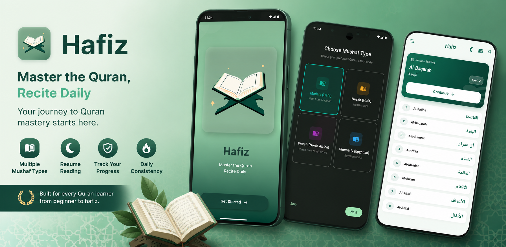

# Hafiz — Quran Memorization Assistant



**Maintain your daily connection with the Quran — read, memorize, perfect your recitation, and track your progress.**

[](https://play.google.com/store/apps/details?id=com.hafiz.app.hafiz_app)
[](https://youtu.be/gk_molLx7yE)
[](https://youtu.be/A9g0FEGydnY)
[](LICENSE)
[](https://flutter.dev)

---

## Get the App

| Platform | Link | Version |
|---|---|---|
| **Google Play** | [Play Store](https://play.google.com/store/apps/details?id=com.hafiz.app.hafiz_app) | v3.3.0 (rolling out) |
| **Internal Testing** | [Join on Play Console](https://play.google.com/apps/internaltest/4701498538025179659) | v3.3.0+26 |
| **Firebase Distribution** | [Become a Tester](https://appdistribution.firebase.dev/i/666b22e0b5074ff4) | v3.3.0+26 |
| **Direct APK** | [Download APK](https://github.com/moatazhamada/HafizApp/raw/hackathon-demo-page/appbundle/hafiz-3.3.0+26.apk) | v3.3.0+26 |

> **Seeing an old version on the store?** Rollouts can be gradual by region. If you still see v3.1.0, use the Internal Testing, Firebase Distribution, or direct APK links above to get v3.3.0+26 immediately.

---

## Features

### 📖 Reading
- **Mushaf View** — 604-page horizontal RTL PageView with 3 rendering modes (text, ayah images, QF glyph code_v2), jump-to-page, surah info overlay
- **Surah-by-Surah** — Per-verse reading with inline translation toggle, auto-scroll (0.25x–3.0x), juz index grid
- **Audio Player** — Verse-by-verse playback with speed control (0.5x–2x), sleep timer, loop, **background playback with system media controls**

### 🧠 Memorization
- **Hifz Mode** — Hide/reveal verses for self-testing, tap to reveal individual verses
- **Memorization Tracker** — Per-surah status (memorized/in-progress/not-started), spaced-repetition review scheduling
- **Memorization Journal** — Track Hifz progress with spaced-repetition scheduling and due-for-review reminders
- **Practice List** — Mark difficult verses, review them separately

### 🎙 Voice Verification
- Recite any verse and get instant feedback — compares spoken recitation against expected text
- **Word-level accuracy** — Each word color-coded green (correct) or red (mismatch)
- Supports on-device **Whisper** models (tiny/base/small), custom ASR endpoint, and sheikh audio coaching

### 📊 Progress Tracking
- **Khatmah Tracker** — Daily reading goals with interactive presets (10/20/50/100/200 verses), today's progress ring, **Dua Khatm screen on completion**
- **Streak Visualization** — Weekly heatmap + **cloud-reconciled streak** (local streak merged with Quran Foundation cloud streak)
- **Activity Heatmap** — GitHub-style visualization of daily Quran reading activity synced with Quran.Foundation
- **Reading Session Tracking** — Automatic tracking of reading duration and verses read, with weekly insights
- **Memorization Dashboard** — Overall progress, due-for-review reminders, per-surah status cards
- **Statistics** — Bookmark count, practice verse count, reading activity summary

### ☁️ Cloud Sync (Quran Foundation)
- **Bookmark Sync** — Bidirectional push/pull via QF Collections ("Hafiz Bookmarks")
- **Activity Sync** — Daily reading activity reported to QF for streak computation
- **Goals Sync** — Daily verse targets pushed to QF Goals API
- **OAuth2/OpenID Connect** — Secure authentication with PKCE, token refresh, "Delete My Data" support

### 🎨 UX
- **Adaptive Home Surfaces** — Home screen adapts to Reader, Student, or Seeker archetypes based on behavior
- **Onboarding Archetypes** — Choose your profile (Reader, Student, Seeker, Devotee) for a personalized experience
- **Responsive / Tablet Support** — NavigationRail and optimized layouts on screens >900px
- Shimmer loading skeletons on khatmah dashboard, bookmarks list, and surah screens
- Haptic feedback on bookmark toggle, hifz mode reveal, voice verification results
- Pull-to-refresh on khatmah dashboard and bookmarks
- Error states with localized messages and retry buttons
- **Smart Notifications** — Daily verse, reading reminders, and Surah Al-Kahf Friday notifications

### ⚙️ Settings
- Language (English/Arabic/System) — all UI and Quran metadata localized
- Theme (Light/Dark/System)
- Quran font size (16–40)
- Orientation (System/Portrait/Landscape)
- Mushaf type (Madani/Egyptian/Indo-Pak/Warsh)
- Recitation coach settings (provider, qiraat, reciter, whisper model)
- Daily verse notification toggle

---

## Architecture

See [ARCHITECTURE.md](./ARCHITECTURE.md) for the full layer diagram, data flow, dependency injection structure, and API integration details.

```
Presentation (UI + BLoC)
    ↓
Domain (Entities, Repository Interfaces, Use Cases)
    ↓
Data (Data Sources, Models, Repository Implementations)
    ↓
Core (Config, Theme, Network, Utils)
```

---

## Supported Platforms

| Platform | Status | Notes |
|---|---|---|
| **Android** | ✅ Fully supported | All features work |
| **iOS** | ✅ Supported | arm64 only (simulator & device) |
| **macOS** | ✅ Supported | arm64 only (Apple Silicon) |
| **Web** | ⚠️ Partial support | Audio/ASR features unavailable (FFI limitation) |
| **Windows** | ⚠️ Buildable | Requires Windows host to build |
| **Linux** | ⚠️ Buildable | Requires Linux host to build |

> **Note:** The `whisper_ggml_plus` plugin uses `dart:ffi` and is incompatible with WebAssembly. Web builds will compile but voice verification features will be unavailable. `home_widget`, `flutter_local_notifications`, and `in_app_review` also have no web support.

---

## Build & Run

### Prerequisites

```bash
# Install dependencies
flutter pub get

# For iOS/macOS: ensure CocoaPods is up to date
pod repo update
```

### Flavors

The app supports two build flavors:

| Flavor | Android Package | iOS/macOS Bundle ID | API Environment |
|---|---|---|---|
| `production` | `com.hafiz.app.hafiz_app` | `com.hafiz.app.hafizapp` | Quran Foundation Production |
| `prelive` | `com.hafiz.app.hafiz_app.prelive` | `com.hafiz.app.hafizapp.prelive` | Quran Foundation Prelive |

> **Note:** iOS/macOS bundle IDs use `hafizapp` (no underscore) because underscores are invalid in Apple bundle identifiers.

### Android

```bash
# Debug
flutter run --flavor production
flutter run --flavor prelive

# Release
flutter build apk --release --flavor production
flutter build appbundle --release --flavor production
```

### iOS

```bash
# Debug (requires iOS device or simulator)
flutter run --flavor production
flutter run --flavor prelive

# Release
flutter build ios --release --flavor production
```

> **iOS Simulator:** The app builds for arm64 simulator only. Apple Silicon Macs support this natively. Intel Macs cannot run the iOS simulator build due to `whisper_ggml_plus` plugin limitations.

### macOS

```bash
# Debug
flutter run --flavor production -d macos
flutter run --flavor prelive -d macos

# Release
flutter build macos --release --flavor production
```

> **macOS:** Only arm64 (Apple Silicon) is supported. The `whisper_ggml_plus` plugin has architecture-specific code that does not compile for x86_64.

### Web

```bash
# Web does not support --flavor; use --dart-define instead
flutter run -d chrome --dart-define=flavor=production
flutter build web --dart-define=flavor=production
```

### Windows & Linux

```bash
# Windows (requires Windows host)
flutter build windows --dart-define=flavor=production

# Linux (requires Linux host)
flutter build linux --dart-define=flavor=production
```

### Tests & Analysis

```bash
# Run all tests
flutter test

# Analyze
flutter analyze
```

---

## API Credentials

The app requires **Quran Foundation API credentials** for cloud sync and authentication. Without credentials, the app will show an initialization error.

### Production

Request access at: https://api-docs.quran.foundation/request-access

Build with your credentials using `--dart-define`:

```bash
flutter run --flavor production \
  --dart-define=QF_CLIENT_ID=your-client-id \
  --dart-define=QF_CLIENT_SECRET=your-client-secret
```

### Prelive

The prelive flavor includes built-in test credentials for development:

```bash
flutter run --flavor prelive
```

### All Available Dart-Defines

| Variable | Required | Description |
|---|---|---|
| `QF_CLIENT_ID` | ✅ Production only | OAuth2 client ID |
| `QF_CLIENT_SECRET` | ✅ Production only | OAuth2 client secret |
| `QF_CONTENT_CLIENT_ID` | ❌ | Content API client ID (falls back to `QF_CLIENT_ID`) |
| `QF_CONTENT_CLIENT_SECRET` | ❌ | Content API client secret (falls back to `QF_CLIENT_SECRET`) |
| `QF_BACKEND_EXCHANGE_URL` | ❌ | Backend proxy URL for confidential client token exchange |
| `QF_PUBLIC_CLIENT` | ❌ | Set to `true` for public client (in-app token exchange) |
| `QF_SCOPE` | ❌ | OAuth2 scope override |
| `QF_CONTENT_BASE` | ❌ | Content API base URL |
| `QURAN_COM_BASE` | ❌ | Quran.com API v4 base URL |
| `QURANHUB_BASE` | ❌ | QuranHub API base URL |
| `QRC_WS_BASE` | ❌ | Qurani.ai QRC WebSocket base URL |
| `QRC_API_KEY` | ❌ | Qurani.ai API key |

---

## Platform-Specific Notes

### Native Audio / Voice Verification

Voice verification uses the `whisper_ggml_plus` plugin (v1.5.2) which bundles `whisper.cpp` / `ggml`. This plugin requires platform-specific native code:

- **iOS/macOS:** The plugin is patched locally in the pub cache to fix architecture-specific symbol issues. If you run `flutter pub get` after clearing the pub cache, you may need to re-apply the patches. See the build error history in this repo for details.
- **Web:** Not supported (FFI unavailable).

### Firebase

Firebase services (Analytics, Crashlytics, Remote Config) are initialized on all platforms except web. Crash symbol uploads are configured for iOS and Android release builds.

### Notifications

Daily verse notifications use `flutter_local_notifications` and are only available on Android and iOS. macOS receives the notification code but does not schedule them.

---

## Quran Text Source

- Unmodified Uthmani text from verified Tanzil repository
- Bundled locally as per-surah JSON under `assets/quran/uthmani/`
- Remote fallback via Quran.com API v4 only if local file is missing

---

## Acknowledgments

- **Original concept & foundation:** [abualgait](https://github.com/abualgait)
- **Source:** [HafizApp](https://github.com/abualgait/HafizApp)
- **Quran Foundation** — APIs for content, authentication, and user data sync
- **Tanzil** — Verified Uthmani Quran text (CC BY-ND 3.0)

This app is non-profit. Intended as a good deed for us and our families.

---

## License

MIT License — see [LICENSE](LICENSE)
