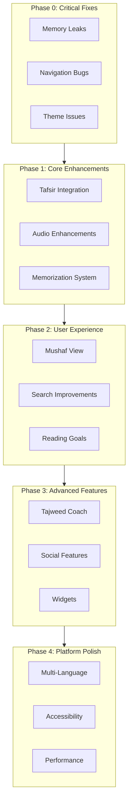
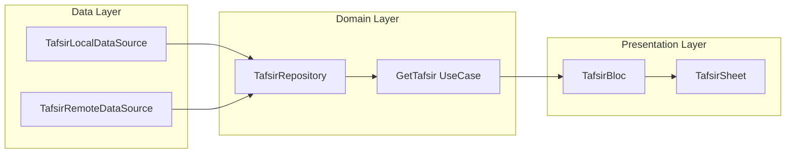
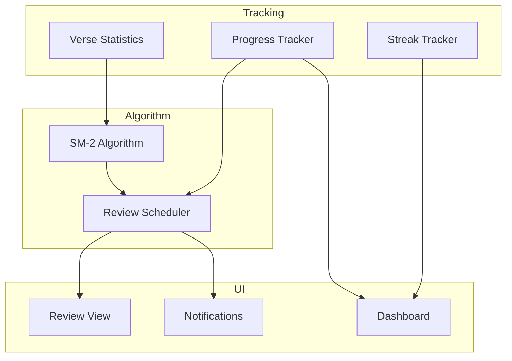

# 🗺️ HafizApp Comprehensive Roadmap

**Version**: 3.0.0+8  
**Last Updated**: February 24, 2026  
**Status**: Planning Phase

---

## 📊 Executive Summary

This roadmap outlines all missing features, technical debt, and improvements needed to transform HafizApp from a functional Quran app into a world-class Islamic application.

### Current State Assessment

| Category | Score | Status |
|----------|-------|--------|
| Core Features | 8/10 | ✅ Solid foundation |
| Performance | 5/10 | ⚠️ Needs optimization |
| Memory Management | 4/10 | ❌ Critical issues |
| User Experience | 7/10 | ⚠️ Some gaps |
| Code Quality | 7/10 | ✅ Good architecture |
| Test Coverage | 7/10 | ⚠️ Needs improvement |

---

## 🎯 Roadmap Overview

---

## 🔴 Phase 0: Critical Fixes (Immediate Priority)

### 0.1 Memory Leaks

| Issue | Location | Impact | Solution |
|-------|----------|--------|----------|
| AudioPlayerHandler leak | [`injection_container.dart:54`](lib/injection_container.dart:54) | App crashes after 5-10 sessions | Already fixed with registerLazySingleton |
| BLoCs not closed | Various screens | Memory leak, battery drain | Add proper dispose calls |
| Hive duplicate init | [`main.dart`](lib/main.dart) | Race conditions | Consolidate initialization |

**Tasks:**
- [ ] Audit all BLoC providers for proper disposal
- [ ] Add `BlocProvider` with `lazy: false` where needed
- [ ] Verify Hive initialization happens only once
- [ ] Add memory profiling tests

### 0.2 Navigation Bugs

| Issue | Location | Impact |
|-------|----------|--------|
| Search scroll-to not working | [`search_screen.dart`](lib/presentation/search/search_screen.dart) | Users can't find searched verses |
| Bookmark navigation broken | [`bookmarks_screen.dart`](lib/presentation/bookmarks/bookmarks_screen.dart) | Bookmarks don't navigate properly |
| Practice list navigation broken | [`recitation_error_screen.dart`](lib/presentation/recitation_error/recitation_error_screen.dart) | Practice items don't navigate |

**Tasks:**
- [ ] Fix scroll-to-verse functionality in SurahScreen
- [ ] Implement verse highlighting after navigation
- [ ] Add scroll position restoration
- [ ] Test deep linking navigation flow

### 0.3 Theme Issues

| Issue | Location | Impact |
|-------|----------|--------|
| Theme setting in Settings not working | [`settings_screen.dart`](lib/presentation/settings_screen/settings_screen.dart) | Users can't switch themes |
| System default theme inconsistency | Various | First launch shows wrong theme |

**Tasks:**
- [ ] Wire theme toggle to ThemeBloc
- [ ] Persist theme preference correctly
- [ ] Handle system theme changes
- [ ] Test theme transitions

### 0.4 Performance Quick Wins

| Issue | Current | Target |
|-------|---------|--------|
| App Startup | 3.5s | <2s |
| Search Response | 2s | <500ms |
| Memory (Active) | 300MB | <200MB |

**Tasks:**
- [ ] Add search result limit (max 100 results)
- [ ] Implement request deduplication
- [ ] Add verse pagination (20 verses per load)
- [ ] Optimize image caching

---

## 🟠 Phase 1: Core Feature Enhancements

### 1.1 Tafsir Integration 📚

**Priority**: HIGH  
**Impact**: Educational value, user engagement

**Features:**
- Multiple Tafsir sources (Ibn Kathir, Jalalayn, Saadi, Muyassar)
- Side-by-side or bottom sheet display
- Search within Tafsir
- Bookmark Tafsir explanations
- Offline Tafsir support

**Architecture:**

**Tasks:**
- [ ] Create Tafsir data models
- [ ] Implement Tafsir repository
- [ ] Add Tafsir API integration
- [ ] Create Tafsir bottom sheet UI
- [ ] Add Tafsir caching
- [ ] Implement Tafsir search

### 1.2 Enhanced Audio Experience 🎵

**Priority**: HIGH  
**Impact**: Core feature improvement

**Features:**
- Multiple reciters (10+ with different Qiraat styles)
- Verse-by-verse repeat with customizable delays
- Download management for offline listening
- Audio speed control (0.5x - 2x)
- Sleep timer with fade-out
- Audio quality selection
- Playlist creation

**Tasks:**
- [ ] Integrate multiple reciter APIs
- [ ] Create download manager with progress tracking
- [ ] Implement audio caching strategy
- [ ] Add custom audio player controls
- [ ] Create reciter selection UI
- [ ] Implement sleep timer

### 1.3 Smart Memorization System 🧠

**Priority**: HIGH  
**Impact**: Core feature for Hafiz users

**Features:**
- Spaced repetition algorithm (SM-2 or Anki-style)
- AI-suggested review schedule
- Difficulty scoring per verse (1-5 stars)
- Daily memorization goals with streak tracking
- Customizable review intervals
- Memorization statistics

**Architecture:**

**Tasks:**
- [ ] Implement SM-2 spaced repetition algorithm
- [ ] Create memorization database schema
- [ ] Add notification system for review reminders
- [ ] Build progress tracking dashboard
- [ ] Create review session UI
- [ ] Implement streak tracking

---

## 🟡 Phase 2: User Experience Improvements

### 2.1 Full Mushaf Continuous View 📖

**Priority**: HIGH  
**Impact**: Premium reading experience

**Features:**
- All 114 Surahs in one continuous scrollable view
- Exact Mushaf page numbers (604 pages for Madani)
- Page flip animations with realistic curl effect
- Visual Surah dividers with ornate Islamic headers
- Page-level bookmarking
- Jump to any page (1-604)
- Zoom and pan controls

**Tasks:**
- [ ] Implement custom page view widget
- [ ] Add page flip animation library
- [ ] Create Mushaf page renderer
- [ ] Optimize for large document rendering
- [ ] Add page bookmark support
- [ ] Implement page navigation UI

### 2.2 Advanced Search & Discovery 🔍

**Priority**: MEDIUM  
**Impact**: Improved usability

**Features:**
- Semantic search (meaning-based)
- Search by topic/theme
- Voice search with Arabic recognition
- Search history and suggestions
- Filters (Makki/Madani, Juz, revelation order)
- Related verses suggestions

**Tasks:**
- [ ] Implement semantic search engine
- [ ] Add topic tagging to verses
- [ ] Integrate voice recognition
- [ ] Create search index optimization
- [ ] Build search filters UI
- [ ] Add search history

### 2.3 Daily Reading Goals & Khatmah Tracker 📊

**Priority**: MEDIUM  
**Impact**: Habit formation

**Features:**
- Set daily pages/verses targets
- Track progress toward completing Quran
- Reading streak calendar with reminders
- Multiple simultaneous Khatmah tracking
- Group reading challenges
- Khatmah completion certificates

**Tasks:**
- [ ] Create goal tracking database
- [ ] Implement notification system
- [ ] Build progress visualization widgets
- [ ] Add certificate generation
- [ ] Create streak calendar UI
- [ ] Implement Khatmah management

---

## 🟢 Phase 3: Advanced Features

### 3.1 AI-Powered Tajweed Coach 🤖

**Priority**: MEDIUM  
**Impact**: Revolutionary feature

**Features:**
- Real-time Tajweed rule detection
- Visual highlighting of Tajweed rules
- Color-coded Tajweed markers
- Personalized pronunciation feedback
- Progress tracking for Tajweed mastery
- Audio comparison with professional reciters

**Tasks:**
- [ ] Integrate Tajweed rules engine
- [ ] Add audio waveform visualization
- [ ] Implement ML model for pronunciation analysis
- [ ] Create Tajweed overlay widget
- [ ] Build feedback UI
- [ ] Add progress tracking

### 3.2 Social & Community Features 👥

**Priority**: MEDIUM  
**Impact**: Engagement and retention

**Features:**
- Khatmah challenges with friends
- Group reading sessions
- Share progress and achievements
- Leaderboards
- Study circles
- Achievement badges

**Tasks:**
- [ ] Implement Firebase Firestore for social features
- [ ] Add real-time sync for group sessions
- [ ] Create leaderboard system
- [ ] Build notification system for social interactions
- [ ] Create profile and friends UI
- [ ] Implement achievement system

### 3.3 Widgets & Quick Actions 📲

**Priority**: LOW  
**Impact**: Convenience

**Features:**
- Home screen widget: Daily verse
- Progress widget: Reading streak
- Quick action: Jump to last read
- Lock screen widget
- Android Quick Settings tile

**Tasks:**
- [ ] Implement home screen widgets
- [ ] Add widget update service
- [ ] Create quick actions
- [ ] Build widget customization UI
- [ ] Test on multiple devices

---

## 🔵 Phase 4: Platform Polish

### 4.1 Multi-Language Support 🌐

**Priority**: MEDIUM  
**Impact**: Global reach

**Languages to Add:**
- Urdu (high priority)
- Turkish
- French
- Malay/Indonesian
- Persian/Farsi
- Bengali

**Tasks:**
- [ ] Create translation management system
- [ ] Add language-specific fonts
- [ ] Implement RTL improvements
- [ ] Create language selection UI
- [ ] Add translation contributions workflow

### 4.2 Accessibility Enhancements ♿

**Priority**: HIGH  
**Impact**: Inclusive design

**Features:**
- Screen reader optimization for Arabic
- Voice commands
- High contrast mode
- Adjustable font sizes
- Haptic feedback
- Color blind friendly themes

**Tasks:**
- [ ] Add semantic labels to all widgets
- [ ] Test with TalkBack and VoiceOver
- [ ] Implement high contrast theme
- [ ] Add font size controls
- [ ] Create accessibility settings

### 4.3 Performance Optimizations ⚡

**Priority**: HIGH  
**Impact**: User experience

**Improvements:**
- Verse pagination
- Image caching limits
- Request deduplication
- Lazy loading
- Debounced search
- HTTP caching headers
- Compressed Hive boxes

**Target Metrics:**
| Metric | Current | Target |
|--------|---------|--------|
| App Startup | 3.5s | <2s |
| Surah Load | 800ms | <300ms |
| Search Response | 2s | <500ms |
| Memory (Idle) | 150MB | <100MB |
| Memory (Active) | 300MB | <200MB |
| Frame Rate | 45fps | 60fps |

**Tasks:**
- [ ] Implement verse pagination
- [ ] Add image cache limits
- [ ] Create request deduplication middleware
- [ ] Optimize Hive compression
- [ ] Add performance monitoring
- [ ] Profile and fix frame drops

---

## 📋 Implementation Checklist

### Phase 0: Critical Fixes
- [ ] Fix memory leaks (AudioPlayerHandler, BLoCs)
- [ ] Fix navigation bugs (search, bookmarks, practice list)
- [ ] Fix theme setting in Settings screen
- [ ] Add search result limits
- [ ] Implement request deduplication

### Phase 1: Core Enhancements
- [ ] Tafsir integration
- [ ] Enhanced audio experience
- [ ] Smart memorization system

### Phase 2: User Experience
- [ ] Full Mushaf continuous view
- [ ] Advanced search
- [ ] Daily reading goals

### Phase 3: Advanced Features
- [ ] AI Tajweed coach
- [ ] Social features
- [ ] Widgets

### Phase 4: Platform Polish
- [ ] Multi-language support
- [ ] Accessibility
- [ ] Performance optimizations

---

## 📈 Success Metrics

### User Engagement
- Daily Active Users: +50%
- Session Duration: 15 min average
- Retention Rate (30-day): 60%
- Khatmah Completion: 10% of users

### Performance
- App Startup: <2 seconds
- Search Response: <500ms
- Memory Usage: <200MB
- Crash-Free Rate: >99.5%

### Quality
- Test Coverage: >90%
- User Rating: >4.5 stars
- Bug Resolution Time: <48 hours

---

## 🗓️ Timeline Overview

| Phase | Focus Area | Key Deliverables |
|-------|------------|------------------|
| Phase 0 | Critical Fixes | Memory leak fixes, navigation bugs, theme issues |
| Phase 1 | Core Features | Tafsir, audio enhancements, memorization system |
| Phase 2 | UX Improvements | Mushaf view, search, reading goals |
| Phase 3 | Advanced | Tajweed coach, social, widgets |
| Phase 4 | Polish | Languages, accessibility, performance |

---

## 📞 Next Steps

1. **Review this roadmap** with stakeholders
2. **Prioritize phases** based on resources
3. **Create detailed tickets** for each task
4. **Set up tracking** for progress monitoring
5. **Begin Phase 0** immediately (critical fixes)

---

*This roadmap is a living document. Update as priorities change and features are completed.*
