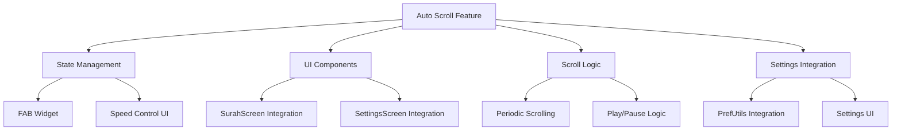

# Auto Scroll Feature Implementation Plan

## Context

The auto scroll feature has translations and preference utilities in [`lib/core/utils/pref_utils.dart`](lib/core/utils/pref_utils.dart:599) but no actual UI implementation exists in the current codebase. This plan adds a complete auto scroll feature with a Floating Action Button (FAB) and customizable speed control.

## Architecture Overview



## Implementation Steps

### 1. Add Auto Scroll State Management to SurahScreen

**File:** [`lib/presentation/surah_screen/surah_screen.dart`](lib/presentation/surah_screen/surah_screen.dart)

Add state variables to `_SurahScreenState`:
```dart
// Auto scroll state
bool _isAutoScrollEnabled = false;
Timer? _autoScrollTimer;
double _autoScrollSpeed = 1.0;
```

Initialize in `didChangeDependencies()`:
```dart
_isAutoScrollEnabled = PrefUtils().getAutoScrollEnabled();
_autoScrollSpeed = PrefUtils().getAutoScrollSpeed();
```

Clean up in `dispose()`:
```dart
_autoScrollTimer?.cancel();
```

### 2. Create Auto Scroll FAB Widget

**File:** [`lib/presentation/surah_screen/surah_screen.dart`](lib/presentation/surah_screen/surah_screen.dart)

Add a Floating Action Button (FAB) that shows:
- Play icon when auto scroll is stopped
- Pause icon when auto scroll is running
- Positioned at bottom-right of the screen

```dart
Widget _buildAutoScrollFab(BuildContext context, bool isDark) {
  return Positioned(
    right: 16,
    bottom: 16,
    child: FloatingActionButton(
      heroTag: 'auto_scroll_fab',
      backgroundColor: isDark ? const Color(0xFF006754) : Colors.teal,
      child: Icon(_isAutoScrollEnabled ? Icons.pause : Icons.play_arrow),
      onPressed: () => _toggleAutoScroll(),
    ),
  );
}
```

### 3. Add Auto Scroll Speed Control UI

**File:** [`lib/presentation/surah_screen/surah_screen.dart`](lib/presentation/surah_screen/surah_screen.dart)

Add a bottom sheet or dialog for speed control with:
- Slider for continuous speed adjustment (0.1x to 5.0x)
- Preset speed buttons (Slow: 0.5x, Normal: 1.0x, Fast: 2.0x)
- Current speed display

```dart
void _showAutoScrollSpeedControl(BuildContext context, bool isDark) {
  showModalBottomSheet(
    context: context,
    builder: (context) => Container(
      padding: const EdgeInsets.all(24),
      child: Column(
        mainAxisSize: MainAxisSize.min,
        children: [
          Text('lbl_auto_scroll_speed'.tr, style: TextStyle(fontSize: 18, fontWeight: FontWeight.bold)),
          const SizedBox(height: 16),
          Row(
            children: [
              Expanded(
                child: Slider(
                  value: _autoScrollSpeed,
                  min: 0.1,
                  max: 5.0,
                  divisions: 49,
                  label: '${_autoScrollSpeed.toStringAsFixed(1)}x',
                  onChanged: (value) {
                    setState(() => _autoScrollSpeed = value);
                    PrefUtils().setAutoScrollSpeed(value);
                  },
                ),
              ),
              IconButton(
                icon: const Icon(Icons.close),
                onPressed: () => Navigator.pop(context),
              ),
            ],
          ),
          const SizedBox(height: 16),
          Row(
            mainAxisAlignment: MainAxisAlignment.spaceEvenly,
            children: [
              _buildSpeedPreset(context, 'lbl_slow'.tr, 0.5, isDark),
              _buildSpeedPreset(context, 'lbl_normal'.tr, 1.0, isDark),
              _buildSpeedPreset(context, 'lbl_fast'.tr, 2.0, isDark),
            ],
          ),
        ],
      ),
    ),
  );
}

Widget _buildSpeedPreset(BuildContext context, String label, double speed, bool isDark) {
  return Expanded(
    child: ElevatedButton(
      onPressed: () {
        setState(() => _autoScrollSpeed = speed);
        PrefUtils().setAutoScrollSpeed(speed);
      },
      style: ElevatedButton.styleFrom(
        backgroundColor: _autoScrollSpeed == speed 
            ? (isDark ? const Color(0xFF006754) : Colors.teal)
            : (isDark ? Colors.grey[800]! : Colors.grey[300]!),
      ),
      child: Text(label),
    ),
  );
}
```

### 4. Implement Auto Scroll Logic

**File:** [`lib/presentation/surah_screen/surah_screen.dart`](lib/presentation/surah_screen/surah_screen.dart)

Add periodic scrolling logic:
```dart
void _toggleAutoScroll() {
  setState(() {
    _isAutoScrollEnabled = !_isAutoScrollEnabled;
    PrefUtils().setAutoScrollEnabled(_isAutoScrollEnabled);
  });

  if (_isAutoScrollEnabled) {
    _startAutoScroll();
  } else {
    _stopAutoScroll();
  }
}

void _startAutoScroll() {
  _autoScrollTimer?.cancel();
  _autoScrollTimer = Timer.periodic(
    Duration(milliseconds: (1000 / _autoScrollSpeed).round()),
    (timer) => _scrollByStep(),
  );
}

void _stopAutoScroll() {
  _autoScrollTimer?.cancel();
  _autoScrollTimer = null;
}

void _scrollByStep() {
  if (!_scrollController.hasClients || !_isAutoScrollEnabled) return;
  
  const double scrollStep = 50.0; // pixels per tick
  final newOffset = _scrollController.offset + scrollStep;
  
  if (newOffset <= _scrollController.position.maxScrollExtent) {
    _scrollController.animateTo(
      newOffset,
      duration: const Duration(milliseconds: 100),
      curve: Curves.linear,
    );
  } else {
    // Reached bottom, stop auto scroll
    _stopAutoScroll();
    setState(() => _isAutoScrollEnabled = false);
    PrefUtils().setAutoScrollEnabled(false);
  }
}
```

### 5. Integrate FAB into SurahScreen UI

**File:** [`lib/presentation/surah_screen/surah_screen.dart`](lib/presentation/surah_screen/surah_screen.dart)

Add the FAB to the vertical scroll mode `Stack`:
```dart
// In the vertical scroll branch (around line 530)
Stack(
  children: [
    // Existing content
    CustomScrollView(...),
    
    // Auto scroll FAB
    if (PrefUtils().getVerseViewMode()) // Only in single-line mode
      _buildAutoScrollFab(context, isDark),
  ],
)
```

Add long press on FAB to show speed control:
```dart
// Update FAB onPressed
onPressed: () {
  if (_isAutoScrollEnabled) {
    _stopAutoScroll();
  } else {
    _startAutoScroll();
  }
},
// Add GestureDetector for long press
GestureDetector(
  onLongPress: () => _showAutoScrollSpeedControl(context, isDark),
  child: _buildAutoScrollFab(context, isDark),
)
```

### 6. Add Auto Scroll Settings to SettingsScreen

**File:** [`lib/presentation/settings_screen/settings_screen.dart`](lib/presentation/settings_screen/settings_screen.dart)

Add auto scroll settings section:
```dart
// Add to state variables
late bool _autoScrollEnabled;
late double _autoScrollSpeed;

// Initialize in initState
_autoScrollEnabled = PrefUtils().getAutoScrollEnabled();
_autoScrollSpeed = PrefUtils().getAutoScrollSpeed();

// Add to ExpansionTile
ExpansionTile(
  title: Text('lbl_auto_scroll_settings'.tr),
  initiallyExpanded: false,
  maintainState: true,
  children: [
    SwitchListTile(
      title: Text('lbl_auto_scroll'.tr),
      subtitle: Text('lbl_auto_scroll_desc'.tr),
      value: _autoScrollEnabled,
      onChanged: (val) {
        setState(() {
          _autoScrollEnabled = val;
          PrefUtils().setAutoScrollEnabled(val);
        });
      },
      activeThumbColor: Colors.teal,
    ),
    ListTile(
      title: Text('lbl_auto_scroll_speed'.tr),
      subtitle: Text('${_autoScrollSpeed.toStringAsFixed(1)}x'),
      trailing: const Icon(Icons.chevron_right),
      onTap: () => _showAutoScrollSpeedDialog(),
    ),
  ],
),
```

Add speed selection dialog:
```dart
void _showAutoScrollSpeedDialog() {
  showDialog(
    context: context,
    builder: (context) => AlertDialog(
      title: Text('lbl_auto_scroll_speed'.tr),
      content: Column(
        mainAxisSize: MainAxisSize.min,
        children: [
          _buildSpeedOption(0.5, 'lbl_slow'.tr),
          _buildSpeedOption(1.0, 'lbl_normal'.tr),
          _buildSpeedOption(2.0, 'lbl_fast'.tr),
        ],
      ),
      actions: [
        TextButton(
          onPressed: () => Navigator.pop(context),
          child: Text('lbl_cancel'.tr),
        ),
      ],
    ),
  );
}

Widget _buildSpeedOption(double speed, String label) {
  return ListTile(
    title: Text(label),
    trailing: Radio<double>(
      value: speed,
      groupValue: _autoScrollSpeed,
      onChanged: (value) {
        setState(() {
          _autoScrollSpeed = value!;
          PrefUtils().setAutoScrollSpeed(value);
        });
        },
    ),
    onTap: () {
      setState(() {
        _autoScrollSpeed = speed;
        PrefUtils().setAutoScrollSpeed(speed);
      });
      Navigator.pop(context);
    },
  );
}
```

### 7. Add Missing Translations

**Files:** 
- [`lib/localization/en_us/en_us_translations.dart`](lib/localization/en_us/en_us_translations.dart)
- [`lib/localization/ar_eg/ar_eg_translations.dart`](lib/localization/ar_eg/ar_eg_translations.dart)

Add translations for auto scroll feature:
```dart
// English
'lbl_auto_scroll': 'Auto-scroll',
'lbl_auto_scroll_settings': 'Auto Scroll Settings',
'lbl_auto_scroll_desc': 'Automatically scroll through verses',
'lbl_auto_scroll_speed': 'Auto Scroll Speed',
'lbl_slow': 'Slow',
'lbl_normal': 'Normal',
'lbl_fast': 'Fast',

// Arabic
'lbl_auto_scroll': 'تمرير تلقائي',
'lbl_auto_scroll_settings': 'إعدادات التمرير التلقائي',
'lbl_auto_scroll_desc': 'التمرير التلقائي عبر الآيات',
'lbl_auto_scroll_speed': 'سرعة التمرير',
'lbl_slow': 'بطيء',
'lbl_normal': 'عادي',
'lbl_fast': 'سريع',
```

## Testing Plan

1. Test FAB visibility in single-line mode only
2. Test play/pause toggle functionality
3. Test speed control slider and preset buttons
4. Test auto scroll stops at bottom of content
5. Test settings persistence across app restart
6. Test speed changes in settings reflect in real-time

## Files to Modify

1. [`lib/presentation/surah_screen/surah_screen.dart`](lib/presentation/surah_screen/surah_screen.dart) - Main implementation
2. [`lib/presentation/settings_screen/settings_screen.dart`](lib/presentation/settings_screen/settings_screen.dart) - Settings UI
3. [`lib/localization/en_us/en_us_translations.dart`](lib/localization/en_us/en_us_translations.dart) - English translations
4. [`lib/localization/ar_eg/ar_eg_translations.dart`](lib/localization/ar_eg/ar_eg_translations.dart) - Arabic translations

## Notes

- Auto scroll only works in single-line mode (not rich-text mode)
- Speed range: 0.1x to 5.0x (scrolls 10-500 pixels per second)
- Timer-based approach ensures smooth scrolling regardless of frame rate
- FAB positioned at bottom-right to avoid covering content
- Long press on FAB opens speed control bottom sheet
