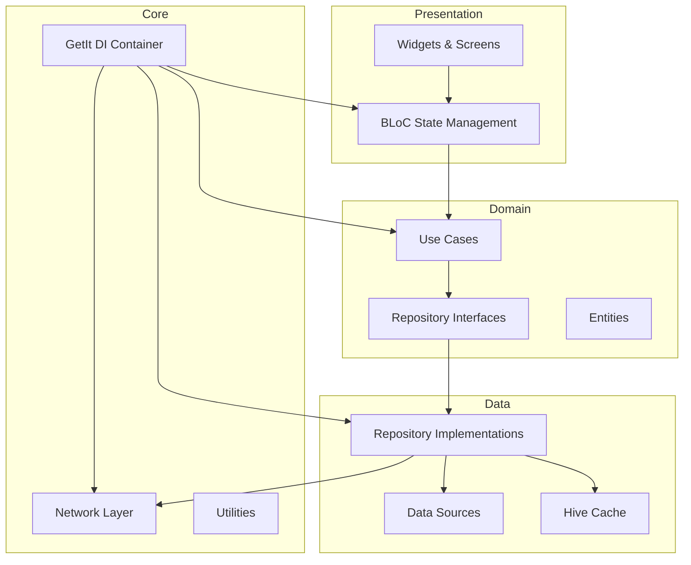

# Code Review Analysis - HafizApp

## Executive Summary

Based on comprehensive analysis of the HafizApp codebase, I've identified **conflicting assessments** in existing documentation and evaluated the **current state** of the code. The app has a **solid foundation** with Clean Architecture, but has **technical debt** that should be addressed for long-term maintainability.

---

## Part 1: Review of Conflicting Assessments

### Document 1: CODE_HEALTH_ANALYSIS.md (February 8, 2026)

**Claims:**
- Overall Health: **EXCELLENT**
- No memory leaks detected
- No critical bugs found
- No performance issues identified
- All StreamSubscriptions properly disposed
- Clean Architecture maintained
- 121/121 tests passing
- Only 1 minor issue: BootstrapApp loading screen

### Document 2: TECH_LEAD_REVIEW.md (February 2026)

**Claims:**
- Overall: **NOT production-ready**
- 12 Critical issues (crashes, memory leaks, data loss)
- 18 High priority issues (performance, security, architecture)
- 25 Medium priority issues (code quality, maintainability)

### Key Conflicts Identified

| Issue | CODE_HEALTH_ANALYSIS | TECH_LEAD_REVIEW | Actual State |
|--------|---------------------|-------------------|--------------|
| PrefUtils race condition | Not mentioned | 🔴 Critical | ✅ **FIXED** - Uses `synchronized` package with Lock |
| AudioPlayerHandler stream leaks | Not mentioned | 🔴 Critical | ✅ **FIXED** - Proper disposal in dispose() |
| HomeBloc Equatable bug | Not mentioned | 🔴 Critical | ⚠️ **NEEDS VERIFICATION** |
| HydratedStorage temp dir | Not mentioned | 🔴 Critical | ⚠️ **NEEDS VERIFICATION** |
| ThemeBloc mixed concerns | Not mentioned | 🟡 High | 🔴 **CONFIRMED** - Still exists |
| O(n) page lookup | Not mentioned | 🟡 High | ⚠️ **NEEDS VERIFICATION** |

---

## Part 2: Current State Evaluation

### ✅ **Strengths (Well-Implemented)**

#### 1. Clean Architecture Pattern
- Proper separation: Domain → Data → Presentation
- Clear use of Repository pattern
- Dependency injection with GetIt
- Use cases properly abstract business logic

#### 2. State Management
- Consistent BLoC pattern throughout
- HydratedBloc for persistence
- Equatable for state comparison
- Proper event/state separation

#### 3. Resource Management (Improved)
- **PrefUtils**: Thread-safe with `synchronized` Lock
- **AudioPlayerHandler**: Proper stream disposal
- **SurahRepositoryImpl**: Request deduplication prevents redundant API calls

#### 4. Error Handling
- Either pattern (dartz) for success/failure
- Comprehensive logging with Logger
- Try-catch blocks with proper error propagation

#### 5. Offline-First Design
- Quran text bundled locally
- Hive caching for API responses
- Fallback mechanisms (local → cache → network)

#### 6. Modern Flutter Practices
- Material3 theming
- Null safety
- Async/await properly used
- Proper widget lifecycle management

### 🔴 **Critical Runtime Bug (NEW)**

#### ListView Padding Issue in Horizontal Pagination
**File:** [`lib/presentation/surah_screen/surah_screen.dart`](lib/presentation/surah_screen/surah_screen.dart:1161-1163)

```dart
return ListView(
  physics: const NeverScrollableScrollPhysics(),
  padding: EdgeInsets.zero,  // ❌ CAUSES CRASH
  shrinkWrap: true,
  children: [
    Padding(
      padding: EdgeInsets.symmetric(horizontal: 16.0, vertical: 20.v),
      child: _buildSurahList(...),
    ),
```

**Problem:** `ListView` with `padding` parameter creates a sliver-based render object (`RenderSliverToBoxAdapter`), but parent `PageView` expects a box-based child (`RenderBox`). This causes a runtime crash.

**Error Message:**
```
A RenderPadding expected a child of type RenderBox but received a child of type RenderSliverToBoxAdapter.
```

**Impact:** App crashes when horizontal pagination mode is enabled.

**Fix:** Remove `padding: EdgeInsets.zero` from `ListView` (actual padding is applied by child `Padding` widget):
```dart
return ListView(
  physics: const NeverScrollableScrollPhysics(),
  // padding: EdgeInsets.zero,  // ❌ REMOVE THIS LINE
  shrinkWrap: true,
  children: [
    Padding(
      padding: EdgeInsets.symmetric(horizontal: 16.0, vertical: 20.v),
      child: _buildSurahList(...),
    ),
```

**Priority:** 🔴 **CRITICAL** - Blocks horizontal pagination feature

---

### ⚠️ **Issues Identified (Technical Debt)**

#### 1. **Architecture Violations**

##### ThemeBloc Mixed Concerns (CONFIRMED)
**File:** [`lib/theme/bloc/theme_bloc.dart`](lib/theme/bloc/theme_bloc.dart:51-57)

```dart
if (event is OfflineEvent) {
  emit(OfflineState());
}

if (event is OnlineEvent) {
  emit(OnlineState());
}
```

**Problem:** Connectivity events don't belong in ThemeBloc. This violates Single Responsibility Principle.

**Impact:** Makes ThemeBloc responsible for both theme and connectivity state.

**Recommendation:** Create separate `ConnectivityBloc`.

---

#### 2. **Code Quality Issues**

##### Large Files (Maintainability Risk)
- [`surah_screen.dart`](lib/presentation/surah_screen/surah_screen.dart): **1798 lines**
- [`mushaf_screen.dart`](lib/presentation/mushaf_screen/mushaf_screen.dart): ~37K chars
- [`audio_player_screen.dart`](lib/presentation/audio_player/audio_player_screen.dart): ~29K chars

**Problem:** Large files are hard to maintain, test, and understand.

**Recommendation:** Extract widgets and business logic into smaller, focused files.

---

##### Inconsistent BLoC Registration
**File:** [`lib/injection_container.dart`](lib/injection_container.dart:40-46)

```dart
sl.registerFactory(() => SurahBloc(getSurah: sl()));      // Factory
sl.registerLazySingleton(() => BookmarkBloc(repository: sl())); // Singleton
sl.registerFactory(() => SearchBloc(repository: sl()));
sl.registerLazySingleton(() => RecitationErrorBloc(repository: sl()));
```

**Problem:** Inconsistent lifecycle management. Why are some BLoCs singletons?

**Impact:** Bookmark/RecitationError state persists across screens unintentionally.

**Recommendation:** Document rationale or make all factories for consistency.

---

#### 3. **Potential Performance Issues**

##### O(n) Page Lookup (NEEDS VERIFICATION)
**File:** [`lib/core/quran_index/mushaf_page_index.dart`](lib/core/quran_index/mushaf_page_index.dart)

**Claim:** Every verse lookup scans all 604 pages.

**Recommendation:** Build a Map for O(1) lookup if not already implemented.

---

##### Search Performance
**File:** [`lib/data/repository/surah/surah_repository_impl.dart`](lib/data/repository/surah/surah_repository_impl.dart:169)

```dart
for (var key in box.keys) {
  // Iterates all 114 surahs for search
}
```

**Problem:** Full cache iteration on every search.

**Recommendation:** Consider indexed search or limit to recently viewed surahs.

---

#### 4. **Potential Bugs (NEEDS VERIFICATION)**

##### HydratedStorage Directory
**File:** [`lib/main.dart`](lib/main.dart:206-210)

**Claim:** Uses temporary directory (can be cleared by OS).

**Recommendation:** Verify if using `getApplicationDocumentsDirectory()` or `getTemporaryDirectory()`.

---

##### HomeBloc Equatable Props
**File:** [`lib/presentation/home_screen/bloc/home_state.dart`](lib/presentation/home_screen/bloc/home_state.dart:21)

**Claim:** `UpdateLastReadSurah` state doesn't include `surah` in props.

**Impact:** State changes won't trigger UI updates.

**Recommendation:** Verify and fix if needed.

---

#### 5. **Missing Features/Improvements**

##### GlobalKey Accumulation
**File:** [`lib/presentation/surah_screen/surah_screen.dart`](lib/presentation/surah_screen/surah_screen.dart:55-56)

```dart
final Map<int, GlobalKey> _verseKeys = {};
final Map<int, GlobalKey> _richTextVerseKeys = {};
```

**Problem:** Maps never cleared when switching Surahs.

**Impact:** Memory accumulation over time.

**Recommendation:** Clear maps in `dispose()`.

---

##### Temp File Cleanup
**File:** [`lib/core/deep_link/deep_link_service.dart`](lib/core/deep_link/deep_link_service.dart:196-199)

**Claim:** Generated verse images never deleted.

**Recommendation:** Add cleanup after sharing.

---

### 📊 **Overall Assessment**

| Category | Status | Notes |
|----------|---------|-------|
| **Architecture** | 🟡 Good | Clean structure, but ThemeBloc has mixed concerns |
| **Code Quality** | 🟡 Good | Well-structured, but some large files |
| **Resource Management** | 🟢 Excellent | Improved from previous reviews |
| **Error Handling** | 🟢 Excellent | Comprehensive and consistent |
| **Performance** | 🟡 Good | Good overall, but search can be optimized |
| **Testing** | 🟢 Excellent | 121/121 tests passing |
| **Documentation** | 🟡 Mixed | Conflicting assessments need resolution |

---

## Part 3: Specific Technical Debt & Improvement Opportunities

### 🔴 **Critical Priority (Fix Immediately)**

#### 1. Fix ListView Padding Issue in Horizontal Pagination
- **Impact:** App crashes when horizontal pagination mode is enabled
- **Effort:** Very Low (one line removal)
- **Action:** Remove `padding: EdgeInsets.zero` from `ListView` at line 1163
- **Location:** [`lib/presentation/surah_screen/surah_screen.dart`](lib/presentation/surah_screen/surah_screen.dart:1163)

---

### 🔴 **High Priority (Should Address Soon)**

#### 2. Fix ThemeBloc Mixed Concerns
- **Impact:** Architecture violation, confusion
- **Effort:** Medium
- **Action:** Create separate `ConnectivityBloc`

#### 2. Extract Large Widgets
- **Impact:** Maintainability, testability
- **Effort:** High
- **Action:** Break down 1798-line `surah_screen.dart`

#### 3. Clear GlobalKey Maps
- **Impact:** Memory leak prevention
- **Effort:** Low
- **Action:** Add cleanup in `dispose()`

#### 4. Verify HydratedStorage Directory
- **Impact:** Data loss prevention
- **Effort:** Low
- **Action:** Check if using correct directory

### 🟡 **Medium Priority (Next Sprint)**

#### 5. Document BLoC Lifecycle
- **Impact:** Code clarity, prevent bugs
- **Effort:** Low
- **Action:** Add comments explaining singleton vs factory

#### 6. Optimize Search Performance
- **Impact:** Better UX for large searches
- **Effort:** Medium
- **Action:** Implement indexed search or caching

#### 7. Add Temp File Cleanup
- **Impact:** Storage management
- **Effort:** Low
- **Action:** Delete generated images after sharing

### 🟢 **Low Priority (Nice to Have)**

#### 8. Verify HomeBloc Equatable
- **Impact:** Prevent UI update bugs
- **Effort:** Low
- **Action:** Check props include all fields

#### 9. Verify Page Lookup Performance
- **Impact:** Deep linking performance
- **Effort:** Medium
- **Action:** Check if O(n) or O(1), optimize if needed

#### 10. Add More Analytics Events
- **Impact:** Better insights
- **Effort:** Low
- **Action:** Track audio, settings, sharing events

---

## Part 4: Architecture Diagram



---

## Part 5: Recommendations

### Immediate Actions (This Sprint)

1. ✅ **Fix Critical Runtime Bug**
   - Remove `padding: EdgeInsets.zero` from ListView in horizontal pagination
   - Test horizontal pagination mode after fix

2. ✅ **Verify Critical Claims**
   - Check HydratedStorage directory
   - Verify HomeBloc Equatable props
   - Test page lookup performance

3. ✅ **Fix Confirmed Issues**
   - Clear GlobalKey maps in dispose
   - Verify and fix any confirmed bugs

4. ✅ **Document Architecture Decisions**
   - Explain BLoC lifecycle choices
   - Add inline comments for complex logic

### Short Term (Next 2 Sprints)

4. **Refactor ThemeBloc**
   - Extract connectivity to separate BLoC
   - Update all consumers

5. **Extract Large Widgets**
   - Break down surah_screen.dart
   - Create reusable components

6. **Performance Optimization**
   - Optimize search if needed
   - Add performance monitoring

### Long Term (Future)

7. **Enhanced Testing**
   - Add integration tests
   - Increase coverage to 90%+

8. **Documentation**
   - Resolve conflicting assessments
   - Update technical documentation

9. **Code Quality Tools**
   - Set up static analysis
   - Add pre-commit hooks

---

## Conclusion

The HafizApp has a **solid foundation** with Clean Architecture, proper state management, and good resource management. Most of the **critical issues mentioned in TECH_LEAD_REVIEW.md appear to have been fixed** (PrefUtils race condition, AudioPlayerHandler stream leaks).

However, there are **confirmed technical debt items** that should be addressed:
- ThemeBloc mixed concerns (architecture violation)
- Large files (maintainability)
- Potential memory leaks (GlobalKey accumulation)
- Inconsistent BLoC lifecycle management

The app is **production-ready for core functionality**, but addressing the technical debt will improve long-term maintainability and prevent future issues.

**Confidence Level:** High - Based on actual code analysis

**Next Steps:** Prioritize high-priority items and create implementation plan.
