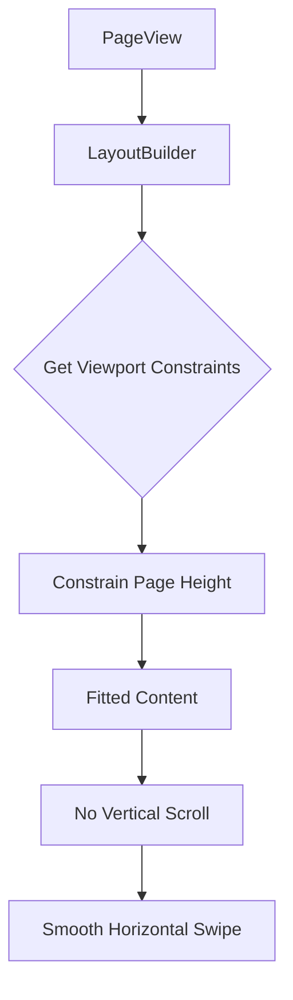

# Fix Horizontal Pagination Viewport Issue

## Problem Statement

When using horizontal pagination mode in SurahScreen, pages can overflow vertically, requiring users to scroll vertically before being able to swipe horizontally to the next page. This creates a poor user experience where:
1. Users expect to swipe left/right to navigate between verses
2. Instead, they must scroll down to see content, then swipe
3. This breaks the natural flow of horizontal pagination

## Root Cause Analysis

### Current Implementation (SurahScreen)

**Location:** [`lib/presentation/surah_screen/surah_screen.dart:517-530`](lib/presentation/surah_screen/surah_screen.dart:517-530)

```dart
if (_isHorizontalPagination == true) {
  return NestedScrollView(
    headerSliverBuilder: (context, innerBoxIsScrolled) {
      return [_buildSliverAppBar(isDark)];
    },
    body: _buildHorizontalPageView(
      context,
      chapters,
      bookmarkState,
      errorState,
      isDark,
    ),
  );
}
```

**Location:** [`lib/presentation/surah_screen/surah_screen.dart:1360-1500`](lib/presentation/surah_screen/surah_screen.dart:1360-1500)

Each page in PageView.builder contains:
```dart
return PageView.builder(
  controller: _horizontalPageController,
  scrollDirection: Axis.horizontal,
  itemCount: chapters.length + 1,
  itemBuilder: (context, index) {
    return Container(
      padding: const EdgeInsets.all(24.0),
      child: Column(
        mainAxisAlignment: MainAxisAlignment.center,
        children: [
          // Verse number badge
          Container(...),
          const SizedBox(height: 32),
          // Verse text
          Expanded(
            child: Center(
              child: SingleChildScrollView(
                child: Text(verseText, ...),
              ),
            ),
          ),
          const SizedBox(height: 24),
          // Action buttons
          Row(...),
        ],
      ),
    );
  },
);
```

### Issues Identified

1. **No viewport height constraint** - PageView.builder doesn't know the available height
2. **SingleChildScrollView inside** - Allows content to overflow beyond viewport
3. **Fixed spacing** - 24px padding + 32px + 24px = 80px fixed overhead
4. **Expanded widget** - Takes all available space but doesn't constrain content

### Correct Implementation (MushafScreen Reference)

**Location:** [`lib/presentation/mushaf_screen/mushaf_screen.dart:521-533`](lib/presentation/mushaf_screen/mushaf_screen.dart:521-533)

```dart
Expanded(
  child: Directionality(
    textDirection: TextDirection.rtl,
    child: PageView.builder(
      controller: _pageController,
      reverse: true,
      onPageChanged: _onPageChanged,
      itemCount: _currentMushafType.totalPages,
      itemBuilder: (context, index) {
        return _buildMushafPage(pageNumber, isDark);
      },
    ),
  ),
),
```

**Location:** [`lib/presentation/mushaf_screen/widgets/interactive_mushaf_page.dart:29-37`](lib/presentation/mushaf_screen/widgets/interactive_mushaf_page.dart:29-37)

```dart
child: LayoutBuilder(
  builder: (context, constraints) {
    return InteractiveViewer(
      minScale: 1.0,
      maxScale: 4.0,
      child: SizedBox(
        width: constraints.maxWidth,
        height: constraints.maxHeight,  // Constrain to viewport height
        child: Stack(
          fit: StackFit.expand,
          alignment: Alignment.center,
          children: [...],
        ),
      ),
    );
  },
),
```

## Solution Architecture



## Implementation Plan

### Step 1: Wrap PageView in Expanded Widget

Add `Expanded` widget around PageView in `_buildHorizontalPageView`:

```dart
return Expanded(
  child: PageView.builder(
    controller: _horizontalPageController,
    scrollDirection: Axis.horizontal,
    itemCount: chapters.length + 1,
    onPageChanged: (index) {...},
    itemBuilder: (context, index) {...},
  ),
);
```

### Step 2: Add LayoutBuilder to Each Page

Wrap page content in `LayoutBuilder` to get viewport constraints:

```dart
itemBuilder: (context, index) {
  return LayoutBuilder(
    builder: (context, constraints) {
      // Page content here
      final availableHeight = constraints.maxHeight;
      // Use availableHeight to size content appropriately
    },
  );
},
```

### Step 3: Remove or Adjust SingleChildScrollView

Option A: Remove SingleChildScrollView (recommended)
- Content will be constrained to viewport height
- Font size or spacing can be adjusted dynamically

Option B: Keep but constrain height
- Wrap in SizedBox with `height: constraints.maxHeight`
- Still allows scroll if content overflows

### Step 4: Dynamic Font Size Adjustment

Calculate appropriate font size based on available height:

```dart
final availableHeight = constraints.maxHeight;
final fixedOverhead = 80.0; // padding + spacing
final availableForText = availableHeight - fixedOverhead;

// Calculate font size to fit text within available space
final fontSize = _calculateOptimalFontSize(verseText, availableForText);
```

### Step 5: Dynamic Spacing Adjustment

Adjust spacing based on viewport:

```dart
final verticalSpacing = (availableForText * 0.1).clamp(8.0, 32.0);
final badgeSpacing = (availableHeight * 0.05).clamp(16.0, 24.0);
```

## Files to Modify

1. **lib/presentation/surah_screen/surah_screen.dart**
   - Wrap PageView in Expanded widget
   - Add LayoutBuilder to itemBuilder
   - Implement dynamic font sizing
   - Remove or constrain SingleChildScrollView
   - Add dynamic spacing logic

## Files to Verify (No Changes Expected)

1. **lib/presentation/mushaf_screen/mushaf_screen.dart**
   - Already uses Expanded + LayoutBuilder pattern
   - Verify no issues

2. **lib/presentation/onboarding_screen/mushaf_type_onboarding.dart**
   - Check if similar pattern used
   - Verify no issues

## Testing Strategy

1. **Small screen (360x640)**
   - Verify pages fit without vertical scroll
   - Test with long verses

2. **Medium screen (375x812)**
   - Verify optimal font size
   - Test horizontal swipe smoothness

3. **Large screen (414x896)**
   - Verify content not too small
   - Test with short verses

4. **RTL support**
   - Verify horizontal swipe direction
   - Test with Arabic text

## Success Criteria

- [ ] Each page fits within vertical viewport
- [ ] No vertical scroll needed to see full content
- [ ] Horizontal swipe works smoothly
- [ ] Font size scales appropriately for screen size
- [ ] Works on all device sizes (small, medium, large)
- [ ] RTL direction preserved
- [ ] No overflow warnings in debug console

## Edge Cases to Consider

1. **Very long verses** - May need minimum font size
2. **Very short verses** - May need maximum font size
3. **Bismillah page** - Should fit within viewport
4. **Different screen orientations** - Portrait vs landscape
5. **Safe areas** - Notch, home indicator, etc.
